# Exercise Sheet 3. Scheduling (P&P)

<!-- TOC depthFrom:2 depthTo:6 withLinks:1 updateOnSave:1 orderedList:1 -->

1. [Overview](#overview)
2. [Task 1](#task-1)
3. [Task 2](#task-2)
4. [Task 3](#task-3)

<!-- /TOC -->

<!-- https://mermaid-js.github.io/mermaid-live-editor -->

## Overview

| Process | Arrival Time | Service Time | Priority |
| ------- | ------------ | ------------ | -------- |
| A       | 0            | 7            | 2        |
| B       | 3            | 3            | 1        |
| C       | 4            | 2            | 3        |
| D       | 6            | 5            | 2        |
| E       | 8            | 2            | 3        |

For each task in this exercise:

- create a GANTT chart describing how these processes are assigned to the CPU
  according to the given scheduling algorithms, and
- compute the average _turnaround time_ and _response time_ for each of these
  cases.

__Turnaround__ time is the number of timesteps it takes for a process to be complete. So that's from the time it arrives to the time it finishes running.

__Response time__, or __latency__, is the time it takes for the scheduler to schedule the process, after it has arrived. So the time from arrival to the first execution of the process.

Note that when a process is preempted, **it is always inserted to the back of
the queue**, after any processes that might have arrived in the meantime, or even at the same time the preemption happens.

Note that a **higher number means higher priority**
(i.e., NOT [niceness](<https://en.wikipedia.org/wiki/Nice_(Unix)>)).

## Task 1

1. FCFS (First Come First Served)

<!---
gantt
	axisformat %M

  title First Come First Served

  section A
  A: a1, 2010-10-20 00:00, 7m

  section B
  B: done, b1, 2010-10-20 00:03, 4m
  B: b2, after b1, 3m

  section C
  C: done, c1, 2010-10-20 00:04, 6m
  C: c2, after c1, 2m

  section D
  D: done, d1, 2010-10-20 00:06, 6m
  D: d2, after d1, 5m

  section E
  E: done, e1, 2010-10-20 00:08, 9m
  E: e2, after e1, 2m
-->

| Process      | Turnaround time | Latency |
| ------------ | --------------- | --------|
| A            | 7               | 0       |
| B            | 7               | 4       |
| C            | 8               | 6       |
| D            | 11              | 6       |
| E            | 11              | 9       |
| **Average**: | **8.8**         | **5**   |

2. SPN (Shortest Process Next - i.e., without preemption)

<!---
gantt
	axisformat %M

  title Shortest Process Next

  section A
  A: a1, 2010-10-20 00:00, 7m

  section B
  B: done, b1, 2010-10-20 00:03,8m
  B: b2, after e2, 3m

  section C
  C: done, c1, 2010-10-20 00:04, 3m
  C: c2, after c1, 2m

  section D
  D: done, d1, 2010-10-20 00:06, 8m
  D: d2, after d1, 5m

  section E
  E: done, e1, 2010-10-20 00:08, 1m
  E: e2, after e1, 2m
-->

| Process      | Turnaround time | Latency |
| ------------ | --------------- | --------|
| A            | 7               | 0       |
| B            | 11              | 8       |
| C            | 5               | 3       |
| D            | 13              | 8       |
| E            | 3               | 1       |
| **Average**: | **7.8**         | **4**   |

3. SRT (Shortest Remaining Time Next - i.e., with preemption)

<!---
gantt
	axisformat %M

  title Shortest Remaining Time Next

  section A
  A: a1, 2010-10-20 00:00, 3m
  A: done, a2, after a1, 7m
  A: a3, after e1, 4m

  section B
  B: b1, 2010-10-20 00:03, 3m

  section C
  C: done, c1, 2010-10-20 00:04, 2m
  C: c2, after c1, 2m

  section D
  D: done, d1, 2010-10-20 00:06, 9m
  D: d2, after d1, 5m

  section E
  E: e1, 2010-10-20 00:08, 2m
-->

| Process      | Turnaround time | Latency |
| ------------ | --------------- | --------|
| A            | 14              | 0       |
| B            | 3               | 0       |
| C            | 4               | 2       |
| D            | 13              | 8       |
| E            | 2               | 0       |
| **Average**: | **7.2**         | **2**   |

## Task 2

4. Round Robin (quantum = 1)

<!---
gantt
	axisformat %M

  title Round Robin (quantum = 1)

  section A
  A: a1, 2010-10-20 00:00, 3m
  A: done, a2, after a1, 1m
  A: a3, after a2, 1m
  A: done, a4, after a3, 2m
  A: a5, after a4, 1m
  A: done, a6, after a5, 4m
  A: a7, after a6, 1m
  A: done, a8, after a7, 2m
  A: a9, after a8, 1m

  section B
  B: b1, 2010-10-20 00:03, 1m
  B: done, b2, after b1, 2m
  B: b3, after b2, 1m
  B: done, b4, after b3, 3m
  B: b5, after b4, 1m

  section C
  C: done, c1, 2010-10-20 00:04, 1m
  C: c2, after c1, 1m
  C: done, c3, after c2, 3m
  C: c4, after c3, 1m

  section D
  D: done, d1, 2010-10-20 00:06, 2m
  D: d2, after d1, 1m
  D: done, d3, after d2, 4m
  D: d4, after d3, 1m
  D: done, d5, after d4, 2m
  D: d6, after d5, 3m

  section E
  E: done, e1, 2010-10-20 00:08, 3m
  E: e2, after e1, 1m
  E: done, e3, after e2, 2m
  E: e4, after e3, 1m
-->

| Process      | Turnaround time | Latency |
| ------------ | --------------- | --------|
| A            | 16              | 0       |
| B            | 8               | 0       |
| C            | 6               | 1       |
| D            | 13              | 2       |
| E            | 7               | 3       |
| **Average**: | **10**          | **1.2** |

5. Round Robin (quantum = 4)

<!---
gantt
	axisformat %M

  title Round Robin (quantum = 4)

  section A
  A: a1, 2010-10-20 00:00, 4m
  A: done, a2, after a1, 5m
  A: a3, after a2, 3m

  section B
  B: done, b1, 2010-10-20 00:03, 1m
  B: b2, after b1, 3m

  section C
  C: done, c1, 2010-10-20 00:04, 3m
  C: c2, after c1, 2m

  section D
  D: done, d1, 2010-10-20 00:06, 6m
  D: d2, after d1, 4m
  D: done, d3, after d2, 2m
  D: d4, after d3, 1m

  section E
  E: done, e1, 2010-10-20 00:08, 8m
  E: e2, after e1, 2m
-->

| Process      | Turnaround time | Latency |
| ------------ | --------------- | --------|
| A            | 12              | 0       |
| B            | 4               | 1       |
| C            | 5               | 3       |
| D            | 13              | 6       |
| E            | 10              | 8       |
| **Average**: | **8.8**         | **3.6** |

## Task 3

6. Highest Priority First with preemption

<!---
gantt
	axisformat %M

  title Highest Priority First with preemption

  section A
  A: a1, 2010-10-20 00:00, 4m
  A: done, a2, after a1, 2m
  A: a3, after a2, 2m
  A: done, a4, after a3, 2m
  A: a5, after a4, 1m

  section B
  B: done, b1, 2010-10-20 00:03, 13m
  B: b2, after b1, 3m

  section C
  C: c1, 2010-10-20 00:04, 2m

  section D
  D: done, d1, 2010-10-20 00:06, 5m
  D: d2, after d1, 5m

  section E
  E: e1, 2010-10-20 00:08, 2m
-->

| Process      | Turnaround time | Latency |
| ------------ | --------------- | --------|
| A            | 11              | 0       |
| B            | 16              | 13      |
| C            | 2               | 0       |
| D            | 10              | 5       |
| E            | 2               | 0       |
| **Average**: | **8.2**         | **3.6** |

7. Highest Priority First without preemption

<!---
gantt
	axisformat %M

  title Highest Priority First without preemption

  section A
  A: a1, 2010-10-20 00:00, 7m

  section B
  B: done, b1, 2010-10-20 00:03, 13m
  B: b2, after b1, 3m

  section C
  C: done, c1, 2010-10-20 00:04, 3m
  C: c2, after c1, 2m

  section D
  D: done, d1, 2010-10-20 00:06, 5m
  D: d2, after d1, 5m

  section E
  E: done, e1, 2010-10-20 00:08, 1m
  E: e2, after e1, 2m
-->

| Process      | Turnaround time | Latency |
| ------------ | --------------- | --------|
| A            | 7               | 0       |
| B            | 16              | 13      |
| C            | 5               | 3       |
| D            | 10              | 5       |
| E            | 3               | 1       |
| **Average**: | **8.2**         | **4.4** |
